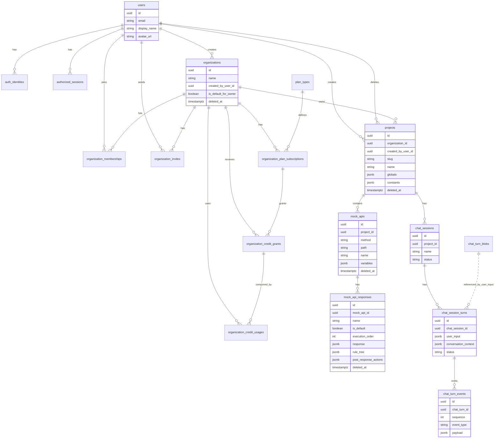

# SynthAPI API Overview

This is a reusable snapshot of `web-apps/apps/api`. Verify against source before finalizing user-facing docs.

## Package Shape

- TypeScript ESM Express API package named `@synthapi/api`.
- Entry point: `src/server.ts`.
- Persistence: PostgreSQL through Kysely models/migrations.
- Runtime state and jobs: Redis used for variable KV state and BullMQ queues.
- Script execution: Pyodide worker pool for custom mock predicates, JSON body scripts, SSE scripts, and post-response scripts.
- AI orchestration: AI SDK streams through configured providers/hosts, with project-scoped tools.
- Ignore `dist/` for source analysis unless built artifacts are explicitly relevant.

## Functionality

- Boot: loads secrets, creates DB client, runs DB migrations, starts Redis KV, starts a Pyodide pool, creates an in-memory event bus, starts BullMQ domain jobs, runs agent config migrations, then mounts Express middleware/routes.
- Auth:
  - Google OAuth provider discovery/start/callback.
  - Auth cookie and Bearer token validation.
  - Provider identity linking through `auth_identities`.
  - Hashed session tokens in `authorized_sessions`.
  - New provider users get a default organization, plus trial subscription, owner membership, provider identity, and seeded default project.
- Profile:
  - Returns current user plus organizations, membership info, active plan info, and AI credit balance.
- Organizations:
  - Create, soft-delete, restore.
  - Invite, accept, revoke invites.
  - Add/remove/leave members.
  - Roles in current code: `owner`, `admin`, `member`, `viewer`.
  - Basic plan and plus plan are modeled through plan subscriptions and credit grants.
  - Maintenance jobs downgrade expired plus trials and permanently delete soft-deleted organizations after retention.
- Projects:
  - Create/list/get/update/soft-delete/restore.
  - Belong to organizations.
  - Include `globals` and `constants` variable definitions.
  - Use generated slug for public mock base URLs.
- Mock APIs:
  - Create/list/get/update/soft-delete/restore endpoint definitions.
  - Fields include project, method, path, name, description, and local variables.
  - `GET /api/v1/mock-apis/:id` includes a generated curl command.
- Mock API responses:
  - Create/list/get/update/delete/restore/reorder responses for a mock API.
  - Responses have `is_default`, `execution_order`, response payload, optional rule tree, and optional post-response actions.
  - Response bodies support JSON, text, empty, Python-generated JSON, and SSE.
- Public mock runtime:
  - Mounted before authenticated `/api/v1` routes.
  - Requires `x-project-slug` for non-API requests.
  - Builds execution context from request URL, method, headers, query, body, cookies, path params, project globals/constants, and mock API variables.
  - Resolves the best mock API match by query key specificity, static segments, dynamic segments, path length, and newest creation time.
  - Evaluates ordered responses, chooses first matching rule tree, falls back to default response, templates response fields, runs post-response actions, then returns HTTP or SSE output.
- Agent chat:
  - Project-scoped chat sessions and turns.
  - Validates project access and AI credits before creating a turn.
  - Persists user input, assistant messages, tool inputs/results, compaction events, and turn-settled events.
  - Streams existing and live turn events through SSE.
  - Uses in-memory event bus for live events and Postgres for replay.
  - Tool registry exposes project tools, mock API tools, mock response tools, UI form rendering, web search, and web scrape.

## Runtime Flow

```mermaid
flowchart TD
  Client[Web app / API client] --> Express[Express app]

  Express --> Health[GET /health]
  Express --> PublicRouter[Public mock router<br/>non-/api/v1 + x-project-slug]
  Express --> ApiRoutes[/api/v1 routes]

  PublicRouter --> ExecuteMock[executePublicMockApi]
  ExecuteMock --> ProjectLookup[Find project by slug]
  ProjectLookup --> MockLookup[Find matching mock_api by method/path/query]
  MockLookup --> Context[Build execution context<br/>request + globals + constants + variables]
  Context --> Redis[(Redis / KV variables)]
  Context --> RuleEngine[Evaluate response rule_tree]
  RuleEngine --> Pyodide[Pyodide for custom predicates/scripts]
  RuleEngine --> SelectedResponse[Selected mock_api_response]
  SelectedResponse --> Template[Apply template values]
  Template --> PostActions[Run post_response_actions]
  PostActions --> Redis
  SelectedResponse --> MockResponse[HTTP JSON/text/empty/SSE response]

  ApiRoutes --> Auth[Auth middleware<br/>cookie or Bearer token]
  Auth --> Sessions[(authorized_sessions)]
  Auth --> Mgmt[Management routes]
  Mgmt --> Orgs[Organizations]
  Mgmt --> Projects[Projects]
  Mgmt --> MockApis[Mock APIs]
  Mgmt --> MockResponses[Mock responses]
  Mgmt --> AgentChat[Project chat assistant]

  AgentChat --> ChatTurns[(chat_session_turns)]
  AgentChat --> Events[(chat_turn_events)]
  AgentChat --> EventBus[In-memory event bus]
  AgentChat --> LLM[LLM stream provider]
  AgentChat --> Tools[Agent tool registry]
  Tools --> Projects
  Tools --> MockApis
  Tools --> MockResponses
```

## Entity Diagram



## Known Gaps To Re-check

- Current TypeScript entity/DTO code supports organization role `viewer`, but the visible migrations create `organization_member_role` as `owner`, `admin`, and `member`. Look for a later migration or manual DB change before assuming `viewer` inserts work.
- `organization_invites.getInvites` filters pending/non-expired invites and also filters by requested status, so non-pending statuses may return empty by construction.
- AI credit usages are modeled, but verify whether chat execution records credit usage before claiming credits are decremented.
