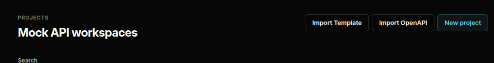

Starting from scratch can be tedious, so SynthAPI provides two powerful tools for bootstrapping your mock endpoints in seconds: **OpenAPI Import** and **Mock API Templates**.

## OpenAPI Import

If you already have a documented API, you can import it directly into a SynthAPI project. 

In your Project dashboard, click the **Import OpenAPI** button and paste your valid OpenAPI 3.x schema (JSON or YAML format). 

SynthAPI will parse the schema and generate:
- A distinct mock endpoint for every operation path and method.
- Detailed descriptions pulled from the specification.
- Default empty responses that you can quickly populate with mock rules, templates, and Python variables.

## Mock API Templates

If you're integrating with a popular service but don't want to build the mocks from scratch, you can use our built-in **Templates**.

Click the **Templates** button in your project dashboard to view a curated library of blueprints for standard API integrations. For example, selecting the **Stripe** template instantly provisions endpoints like `/v1/charges` and `/v1/customers` into your project. 

The templates come pre-configured with realistic payload structures, allowing you to bypass the schema-building phase and immediately begin testing your application's handling of third-party responses.
