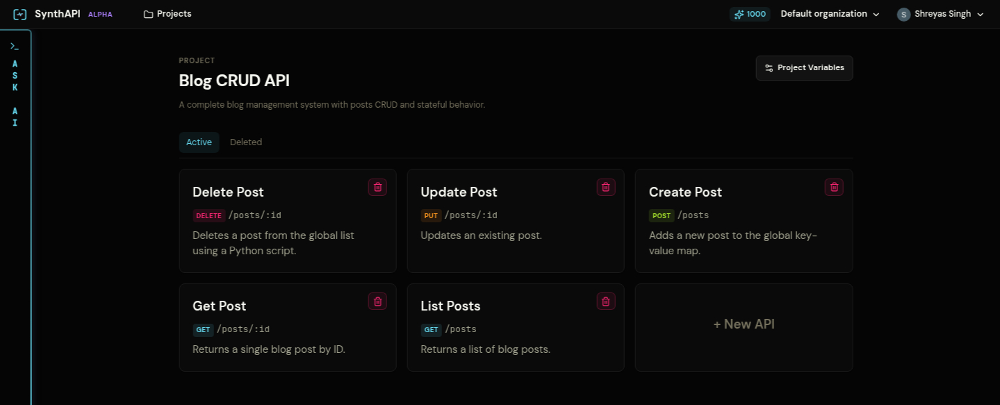

# Blog CRUD API

This walkthrough mirrors the seeded `Blog CRUD API` project. It shows how to model a small REST backend with shared state, conditional responses, and post-response actions.

## What you are building

The finished project contains:

- `GET /posts`
- `GET /posts/:id`
- `POST /posts`
- `PUT /posts/:id`
- `DELETE /posts/:id`

It also stores shared project state in:

- `globals.posts`
- `globals.next_id`
- `globals.total_posts`
- `constants.auth_token`



## 1. Create the project variables

Create a project named `Blog CRUD API` and add:

```text
globals.posts = {}
globals.next_id = 1
globals.total_posts = 0
constants.auth_token = Bearer synth-secret-token
```

These variables are enough to simulate a tiny post store with authorization.

## 2. Add the List Posts API

Create `GET /posts` with two responses:

1. `Unauthorized`
2. `Success` as the default response

The `Unauthorized` response should return `401` when the authorization header does not match the expected bearer token.


The `Success` response should return `200` and use `json_script` to paginate posts from `globals.posts`.


Use this shape in the script:

```python
posts_map = globals.get("posts", {})
all_posts = list(posts_map.values())

query_params = request.get("query_params", {})
page = int(query_params.get("page", 1))
limit = int(query_params.get("limit", 10))

offset = (page - 1) * limit
paginated_posts = all_posts[offset : offset + limit]

return {
    "data": paginated_posts,
    "meta": {
        "total": len(all_posts),
        "page": page,
        "limit": limit
    }
}
```

## 3. Add Get Post with a not-found branch

Create `GET /posts/:id` with three responses:

1. `Unauthorized`
2. `Not Found`
3. `Success` as the default

Use a custom Python predicate for `Not Found` so the response matches when the requested `:id` does not exist in `globals.posts`.

Keep the final `Success` response default and return the selected post with `json_script`.

## 4. Add Create Post with validation and post-response mutation

Create `POST /posts` with three responses:

1. `Unauthorized`
2. `Invalid Request Body`
3. `Post Created` as the default

The validation branch should return `400` when:

- `title` is missing, empty, or too long
- `content` is missing, empty, or too long
- `status` is not `draft` or `published`
- another post already uses the same title

The `Post Created` response returns `201`, then writes the new post into project state using a script action.


The script should generate actions that:

1. set `globals.posts`
2. increment `globals.next_id`
3. increment `globals.total_posts`

## 5. Add Update Post

Create `PUT /posts/:id` with:

1. `Unauthorized`
2. `Not Found`
3. `Post Updated` as the default

Reuse the same missing-ID pattern from `GET /posts/:id`. In the default response, use a script action to merge request fields into the stored post and write the updated `globals.posts` map back to project state.

## 6. Add Delete Post

Create `DELETE /posts/:id` with:

1. `Unauthorized`
2. `Not Found`
3. `Success` as the default

The default response returns a success message, then deletes the post from `globals.posts` and decrements `globals.total_posts`.

## 7. Test the flow

Replace `<project-slug>` with your mock project slug.

```bash
curl -i https://synthapi.dev/mock/<project-slug>/posts
```

This should return `401`.

```bash
curl -i \
  -H "Authorization: Bearer synth-secret-token" \
  -H "Content-Type: application/json" \
  -d '{"title":"Hello","content":"World","status":"draft"}' \
  https://synthapi.dev/mock/<project-slug>/posts
```

This should return `201` and create post `1`.

```bash
curl -i \
  -H "Authorization: Bearer synth-secret-token" \
  https://synthapi.dev/mock/<project-slug>/posts/1
```

This should now return the stored post.

## What to verify

- invalid auth always matches before any success branch
- invalid request bodies stop before state mutation
- successful create, update, and delete calls change later reads
- the default success response stays last in each API
