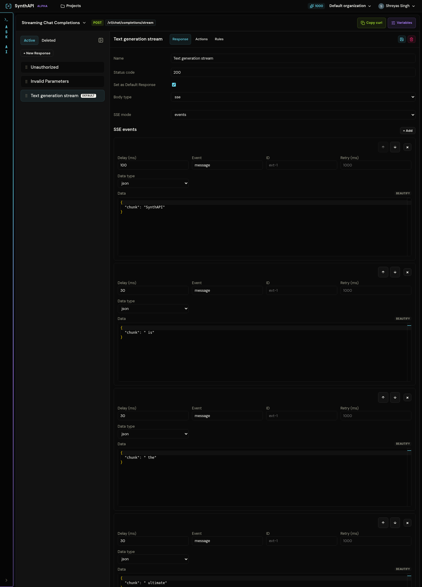

# LLM SSE Events

This walkthrough mirrors the seeded `Mock LLM` project. It shows how to model both standard JSON completions and streaming completions over Server-Sent Events.

## What you are building

The finished project contains:

- `POST /v1/chat/completions`
- `POST /v1/chat/completions/stream`

And one project constant:

```text
constants.expected_api_key = sk-synth-12345
```

## 1. Add the non-streaming completions API

Create `POST /v1/chat/completions` with three responses:

1. `Unauthorized`
2. `Invalid Parameters`
3. `Successful Completion` as the default

Use `Unauthorized` to reject requests where <code v-pre>{{request.headers.x-api-key}}</code> does not equal <code v-pre>{{constants.expected_api_key}}</code>.

Use `Invalid Parameters` to reject requests where:

- <code v-pre>{{request.body.value.model}}</code> is empty
- <code v-pre>{{request.body.value.messages}}</code> is an empty array

Keep `Successful Completion` as the default `200` response that returns a JSON completion payload.

## 2. Add the streaming completions API

Create `POST /v1/chat/completions/stream` with three responses:

1. `Unauthorized`
2. `Invalid Parameters`
3. `Text generation stream` as the default

The first two branches follow the same pattern as the non-streaming API. The difference is the default response.

## 3. Configure the SSE response

Set the default response to:

- status `200`
- `content-type: text/event-stream`
- `cache-control: no-cache`
- body type `sse`
- SSE mode `events`



Each event represents one chunk in the output stream. The seeded example uses:

- an initial event with a slightly larger delay
- many `message` events carrying chunk JSON
- a final `done` event carrying completion metadata

This produces a stream that feels like token-by-token or word-by-word model output.

## 4. Why the response ordering matters

Keep the responses ordered as:

1. `Unauthorized`
2. `Invalid Parameters`
3. `Text generation stream`

That ensures auth and validation failures terminate the request before the stream starts. Once the stream response matches, it becomes the fallback happy path for valid requests.

## 5. Test the non-streaming endpoint

Replace `<project-slug>` with your mock project slug.

```bash
curl -i \
  -H "x-api-key: sk-synth-12345" \
  -H "Content-Type: application/json" \
  -d '{"model":"gpt-4o-mini","messages":[{"role":"user","content":"Hello"}]}' \
  https://synthapi.dev/mock/<project-slug>/v1/chat/completions
```

This should return a JSON completion.

## 6. Test the streaming endpoint

Use `curl -N` so the output is printed as the events arrive.

```bash
curl -N \
  -H "x-api-key: sk-synth-12345" \
  -H "Content-Type: application/json" \
  -d '{"model":"gpt-4o-mini","temperature":0.7}' \
  https://synthapi.dev/mock/<project-slug>/v1/chat/completions/stream
```

You should see multiple SSE events followed by a final `done` event.

## What to verify

- invalid API keys return `401` before any streaming logic begins
- invalid parameters return `400`
- valid requests receive `text/event-stream`
- event ordering and delays produce a readable incremental stream
