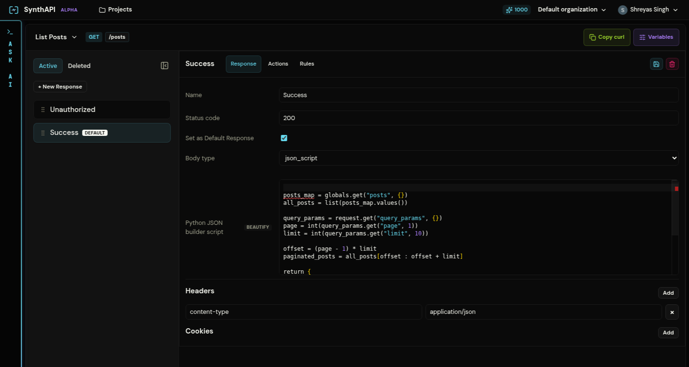

# Responses and Ordering

A **response** is one possible outcome for a mock API. It combines:

- a status code
- optional headers
- optional cookies
- a body
- an optional rule tree
- optional post-response actions
- a position in the execution order

## The Response tab

The `Response` tab controls what the caller receives.

From this screen you can set:

- the response name
- the status code
- whether it is the default response
- the body type
- headers and cookies

### Supported body types

The platform currently supports these response body modes:

- `json`: static JSON
- `json_script`: Python that returns JSON at request time
- `text`: plain text body
- `empty`: no body
- `sse`: Server-Sent Events, either as discrete events or a script

The seeded `List Posts` example uses `json_script` to paginate the `posts` global from query parameters.

## What each response usually means

The seeded examples use a small set of response roles repeatedly:

| Response name | Typical role |
| --- | --- |
| `Unauthorized` | Reject the request before any main logic runs |
| `Invalid Request Body` / `Invalid Parameters` | Reject malformed or unsupported input |
| `Not Found` | Reject a request for missing state |
| `Success` / `Post Created` / `Text generation stream` | The main happy-path result |

These names are not hard-coded by the platform, but they are a useful pattern because they map cleanly to ordered branching.

## How ordering works

Responses are evaluated from top to bottom. As soon as one response matches, the runtime stops and serves it.

That means the order itself is part of the behavior:

1. Specific failures should go first
2. Broader validation failures should go next
3. The default success case should usually go last

For example, the seeded **Create Post** flow is ordered as:

1. `Unauthorized`
2. `Invalid Request Body`
3. `Post Created` as the default

The seeded **Streaming Chat Completions** flow is ordered as:

1. `Unauthorized`
2. `Invalid Parameters`
3. `Text generation stream` as the default

This keeps error branches narrow and predictable while leaving the final default response as the fallback.

## Default responses

The default flag does not make a response run first. It marks the fallback response that should be used when no earlier conditional response matches.

In practice:

- keep only one default response per API
- put it after your conditional branches
- treat it as the main success path unless you have a deliberate reason not to

The **[Blog CRUD API walkthrough](/examples/blog-crud-api)** and **[LLM SSE Events walkthrough](/examples/llm-sse-events)** both follow this pattern.
