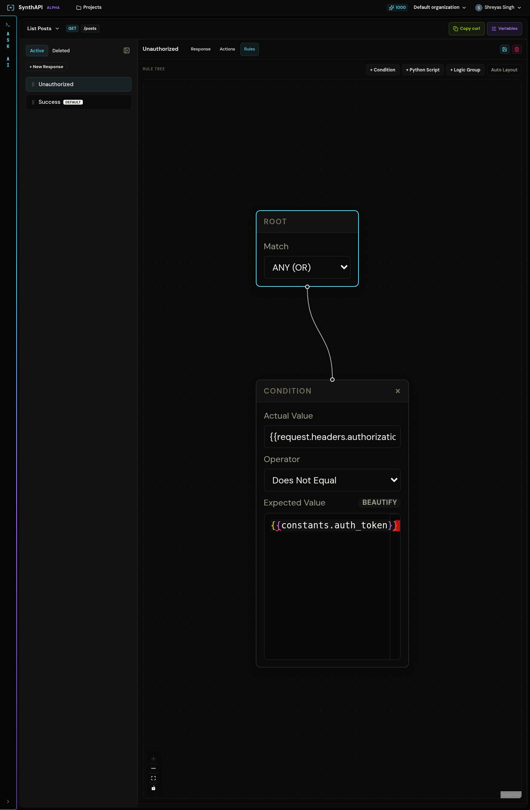
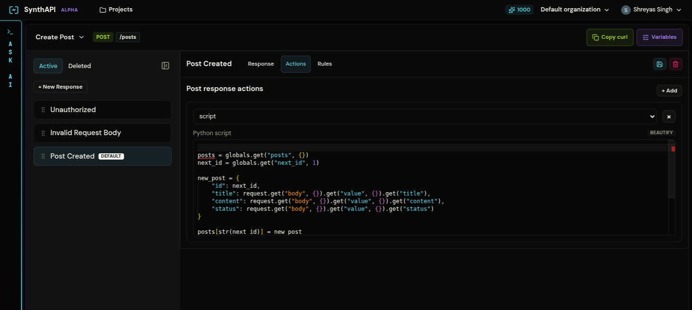

# Rule Trees and Post-Response Actions

The `Rules` and `Actions` tabs turn a static response into a stateful branch in a larger workflow.

## Rule Trees

A **rule tree** decides whether a response matches the current request.

Each rule tree starts at a root node and can contain:

- logic groups with `AND` or `OR`
- simple predicates
- custom Python predicates

### What simple predicates check

Simple predicates compare an actual value from the request or state against an operator and, when needed, an expected value.

Common examples:

- <code v-pre>{{request.headers.authorization}}</code> does not equal <code v-pre>{{constants.auth_token}}</code>
- <code v-pre>{{request.body.value.model}}</code> is an empty string
- <code v-pre>{{request.body.value.temperature}}</code> is greater than `2`

### When to use custom Python predicates

Use a Python predicate when the condition depends on logic that is awkward to express as a single comparison.

The seeded projects use custom predicates for cases such as:

- checking whether a requested blog post ID exists in `globals.posts`
- validating a request body against several business rules at once

## Post-response actions

A **post-response action** runs after the response has already been returned to the client. This is the mutation layer of the platform.

Available action types are:

- `set`
- `unset`
- `increment`
- `decrement`
- `append`
- `remove`
- `script`

The first six handle direct variable updates. The `script` action lets Python compute one or more actions dynamically.

## What actions are for

Actions are how you model stateful workflows:

- create a record after a `201`
- update a shared object after a `200`
- increment counters after a successful request
- remove data after a delete flow

In the seeded **Create Post** example, the `Post Created` response returns `201` immediately and then:

1. writes the new post into `globals.posts`
2. increments `globals.next_id`
3. increments `globals.total_posts`

That is why the next request sees different project state even though the response itself is just a JSON payload.

## Rules versus actions

Keep the split clear:

- **Rules** decide whether this response should be selected
- **Actions** mutate state after that response is selected

If a condition should block the response, it belongs in `Rules`. If state should change because the response already happened, it belongs in `Actions`.
