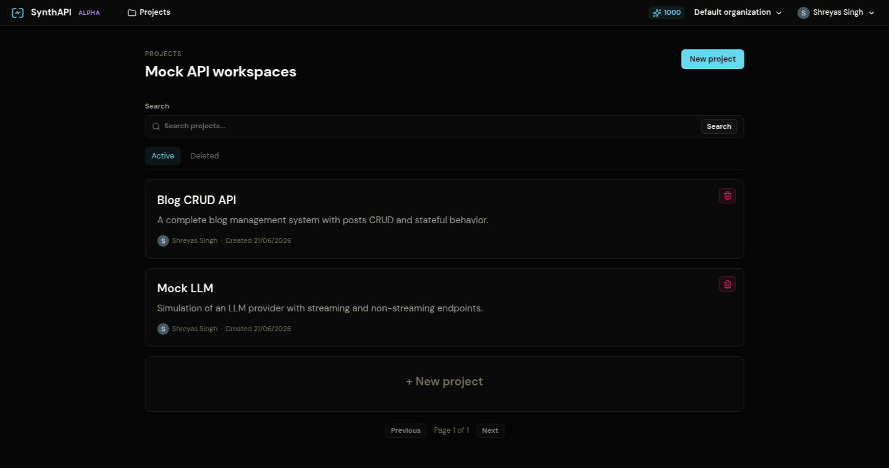

If your workspace was seeded with the default examples, start there. They exercise the main platform features without any setup work.

## 1. Open the seeded projects

After signing in, the Projects screen should contain:

- `Blog CRUD API`
- `Mock LLM`



## 2. Open a project and inspect its APIs

Open **Blog CRUD API** first. This project contains five endpoints for a small stateful REST system.


Each tile on this screen is a **Mock API**. Click one to open its responses.

## 3. Understand the response editor

Open **List Posts**. On the left, you will see the ordered response list. On the right, you edit the selected response through three tabs:

- `Response`: status code, body, headers, cookies, and default flag
- `Actions`: state mutation that runs after this response is sent
- `Rules`: matching logic that decides whether this response should be selected


The selected `Success` response is the default branch. Its body type is `json_script`, which means Python computes the JSON payload at request time.

## 4. Test a mock endpoint

Use **Copy curl** in the top-right of a mock API page, or call the mock URL directly.

```bash
curl -i https://synthapi.dev/mock/<project-slug>/posts
```

That request should match the `Unauthorized` response because the seeded project expects a bearer token.

```bash
curl -i \
  -H "Authorization: Bearer synth-secret-token" \
  "https://synthapi.dev/mock/<project-slug>/posts?page=1&limit=10"
```

That request reaches the default `Success` response and returns paginated posts from project state.

## 5. Continue with the full walkthroughs

- **[Platform Overview](/platform-overview/)** explains the UI and response model in detail.
- **[Blog CRUD API](/examples/blog-crud-api)** walks through a full CRUD setup with rules and post-response actions.
- **[LLM SSE Events](/examples/llm-sse-events)** walks through streaming responses over SSE.
